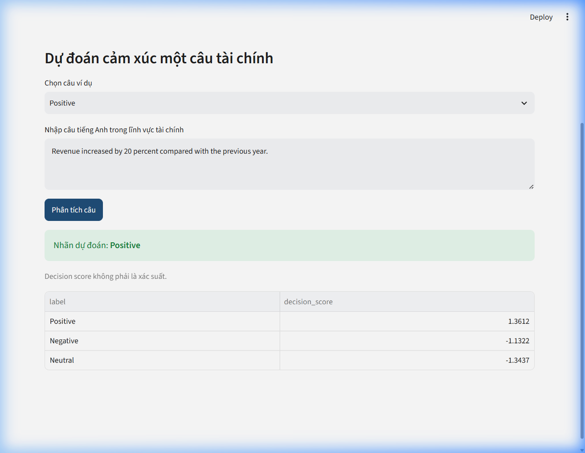

# Financial Sentiment Analysis Application

Ứng dụng NLP phân loại cảm xúc câu tài chính thành ba nhãn: **Negative**, **Neutral** và **Positive**. Bản deploy sử dụng pipeline **TF-IDF + Logistic Regression**, đồng bộ với kết quả tốt nhất từ notebook.

## Tác giả

| Họ tên | GitHub |
|---|---|
| Nguyễn Tùng Dương | [@ngtd-2609](https://github.com/ngtd-2609) |
| Phạm Thế Duy | [@duyphamdevx](https://github.com/duyphamdevx) |
| Ngô Quang Thiện | [@thyelmot](https://github.com/thyelmot) |

> Kết quả chỉ phản ánh sắc thái ngôn ngữ trong văn bản và không phải khuyến nghị đầu tư hoặc đánh giá toàn diện sức khỏe tài chính của doanh nghiệp.

## Demo

- Link Streamlit: `https://financial-sentiment-analysis-ntd.streamlit.app/`



## Kết quả mô hình Logistic Regression

| Chỉ số | Giá trị |
|---|---:|
| Validation Macro-F1 | 0.8058 |
| Test Accuracy | 0.8571 |
| Test Macro-F1 | 0.8100 |
| Test Macro Precision | 0.8487 |
| Test Macro Recall | 0.7842 |
| Test Weighted-F1 | 0.8545 |

Các chỉ số trên được lấy từ kết quả đánh giá mô hình Logistic Regression
trong notebook của dự án.

## Kiến trúc hệ thống

```text
Financial PhraseBank
        ↓
Kiểm tra và tiền xử lý dữ liệu
        ↓
TF-IDF unigram/bigram
        ↓
Logistic Regression
        ↓
Pipeline Joblib
        ↓
Ứng dụng Streamlit
        ↓
Dự đoán câu tài chính hoặc nội dung PDF
```

Ứng dụng Streamlit không huấn luyện lại mô hình khi chạy. App chỉ tải file `models/financial_sentiment_pipeline.joblib` đã được xuất từ notebook hoặc script huấn luyện.

## Cấu trúc repository

```text
financial-sentiment-analysis-app/
├── app.py
├── model_utils.py
├── requirements.txt
├── README.md
├── .gitignore
├── LICENSE
├── models/
│   ├── financial_sentiment_pipeline.joblib   # tạo sau khi chạy notebook/script
│   └── model_metadata.json
├── notebook/
│   └── Financial_Sentiment_Analysis_Fixed_collab.ipynb
├── assets/
├── sample_data/
├── docs/
├── tests/
├── scripts/
│   └── train_export_model.py
└── .streamlit/
    └── config.toml
```

## Chạy ứng dụng trên máy

```bash
git clone https://github.com/ngtd-2609/financial-sentiment-analysis-app.git
cd financial-sentiment-analysis-app
pip install -r requirements.txt
streamlit run app.py
```

## Cách sử dụng

### Dự đoán một câu

Nhập một câu tài chính tiếng Anh, ví dụ:

```text
Revenue increased by 20 percent compared with the previous year.
```

Ứng dụng trả về nhãn dự đoán và xác suất của từng lớp.

### Phân tích PDF

Tải lên một file PDF có lớp văn bản. Ứng dụng sẽ:

1. Trích xuất nội dung.
2. Tách văn bản thành các câu phù hợp.
3. Dự đoán cảm xúc từng câu.
4. Tổng hợp tỷ lệ các nhãn.
5. Cho phép tải kết quả CSV.

PDF scan chưa được hỗ trợ OCR tự động trong phiên bản hiện tại.

## Hạn chế

- Mô hình huấn luyện trên câu tài chính tiếng Anh, chưa tối ưu cho tiếng Việt.
- Logistic Regression cung cấp xác suất dự đoán, tuy nhiên xác suất này
  không nên được xem là mức bảo đảm tuyệt đối về tính chính xác.
- Biểu diễn TF-IDF còn hạn chế trong việc nắm bắt ngữ cảnh dài,
  hàm ý và các quan hệ ngữ nghĩa phức tạp.
- PDF scan cần OCR, chưa hỗ trợ tự động trong phiên bản đầu.
- Có domain shift giữa Financial PhraseBank và báo cáo thường niên.
- Kết quả không phải khuyến nghị đầu tư.

## Thành viên

| Thành viên | Công việc | Tỷ trọng |
|---|---|---:|
| Nguyễn Tùng Dương | Dữ liệu, tiền xử lý, EDA và báo cáo | 33% |
| Phạm Thế Duy | Xây dựng baseline, huấn luyện, lựa chọn mô hình, đánh giá test, confusion matrix và phân tích lỗi | 33% |
| Ngô Quang Thiện | Demo ứng dụng, PDF, slide và kiểm tra cuối | 33% |

## Tài liệu

- Báo cáo: `docs/Bao_Cao_NLP_Theo_Huong_Ung_Dung.docx`
- Slide: `docs/Slide_NLP_Theo_Huong_Ung_Dung.pptx`
- Notebook: `notebook/Financial_Sentiment_Analysis_Fixed_collab.ipynb`
- Câu hỏi bảo vệ: `docs/Cau_Hoi_Bao_Ve.docx`

## Ghi chú bản quyền dữ liệu

Mã nguồn do nhóm xây dựng có thể dùng theo MIT License. Dataset Financial PhraseBank và các báo cáo doanh nghiệp có điều khoản sử dụng riêng; repository không tuyên bố sở hữu các nguồn dữ liệu này.
